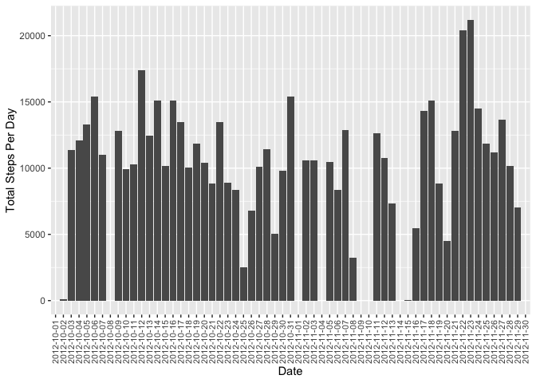
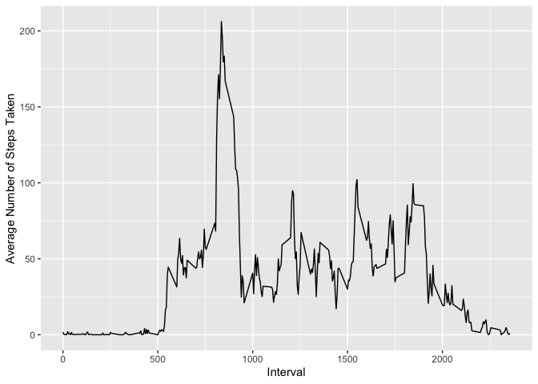
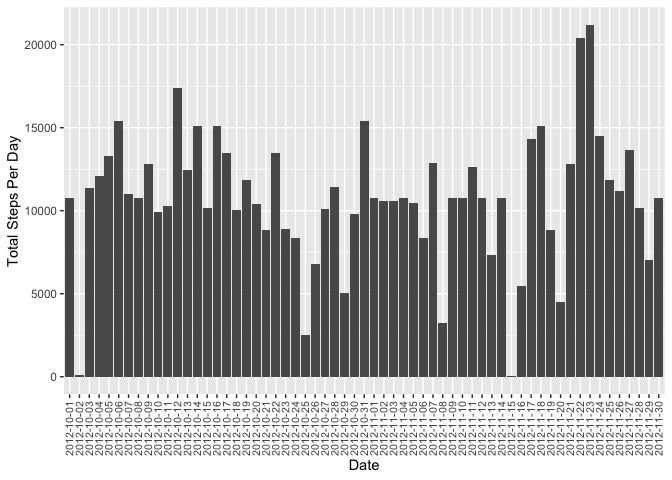
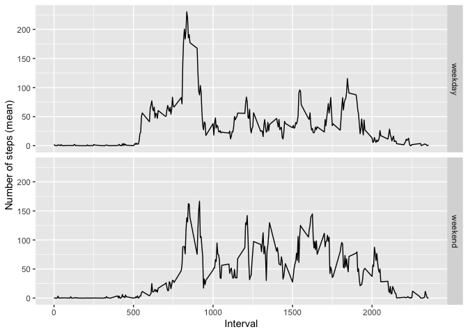

```r
library(data.table)
library(ggplot2)
library(dplyr)
library(lubridate)
```
## Loading and preprocessing the data


```r
dat <- read.csv(unzip("activity.zip"))
dat <- data.table(dat) # transform the data into data.table
```

## What is mean total number of steps taken per day?

```r
x <- dat[,.(total = sum(steps, na.rm = TRUE)), by = date]
# Note: A bar chart is equivalent to a histogram after the transformation above.
ggplot(x, aes(date, total)) + geom_col() + 
  xlab("Date") + ylab("Total Steps Per Day") +
  theme(axis.text.x = element_text(angle = 90, vjust = 0.5, size = 8))
```

<!-- -->

```r
cat("The mean of total number of steps taken per day: ", 
    mean(x$total), " steps")
```

```
## The mean of total number of steps taken per day:  9354.23  steps
```

```r
cat("The median of total number of steps taken per day: ", 
    median(x$total), " steps")
```

```
## The median of total number of steps taken per day:  10395  steps
```


## What is the average daily activity pattern?


```r
mean_steps <- dat[,.(mean = mean(steps, na.rm = TRUE)),by = interval]
ggplot(mean_steps, aes(interval, mean)) + geom_line() + 
  xlab("Interval") + ylab("Average Number of Steps Taken")
```

<!-- -->

```r
cat("The 5-minute interval containing maximum average steps: ",
    mean_steps$interval[which.max(mean_steps$mean)])
```

```
## The 5-minute interval containing maximum average steps:  835
```


## Imputing missing values

```r
cat("Total number of rows with NA: ", sum(rowSums(is.na(dat))) )
```

```
## Total number of rows with NA:  2304
```

```r
# dat_new: original dataset with NAs replaced by means
dat_new <- dat %>% merge(mean_steps, by = "interval") %>%
  mutate(steps = ifelse(is.na(steps), mean, steps))

x <- dat_new[,.(total = sum(steps, na.rm = TRUE)), by = date]
# Note: A bar chart is equivalent to a histogram after the transformation above.
ggplot(x, aes(date, total)) + geom_col() + 
  xlab("Date") + ylab("Total Steps Per Day") +
  theme(axis.text.x = element_text(angle = 90, vjust = 0.5, size = 8))
```

<!-- -->

```r
cat("The mean of total number of steps taken per day (new dataset): ", 
    mean(x$total), " steps")
```

```
## The mean of total number of steps taken per day (new dataset):  10766.19  steps
```

```r
cat("The median of total number of steps taken per day (new dataset): ", 
    median(x$total), " steps")
```

```
## The median of total number of steps taken per day (new dataset):  10766.19  steps
```
#### My answer:
As shown above, both the mean and median increase when analyzed using the new dataset. The total number of steps per day, as shown in the histograms, increases for some days when using the new dataset. The days with increase should correspond to those days with NAs in the original dataset.

## Are there differences in activity patterns between weekdays and weekends?

```r
# Here, let's add another variable called "wday" for "weekend" or "weekday"
dat_new <- dat_new %>% mutate(day = wday(ymd(date), label = TRUE)) %>%
  mutate(wday = ifelse(day %in% c("Sat", "Sun"), "weekend", "weekday"))

mean_new <- dat_new[, .(mean = mean(steps)), by = c("wday", "interval")]
p <- ggplot(mean_new, aes(interval, mean)) + geom_line()
p + facet_grid(row = vars(wday)) + xlab("Interval") + ylab("Number of steps (mean)")
```

<!-- -->

#### My answer:
Yes. The distribution of number of steps during weekday and weekend are quite different. For example, the peak value of number of steps during the weekday is more marked compared to the weekend one, although the time interval for the peak is similar. This weekday peak value may correspond to the time when the subject commutes to work. 
